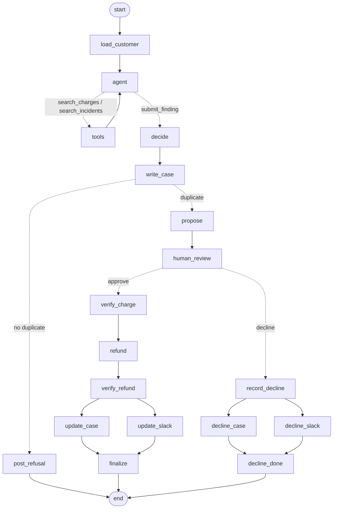

# Warrant

**An AI agent that has to earn the right to move money.**

Warrant investigates customer reports of being charged twice. Using read-only tools, it searches the customer's billing history in **Stripe**, paging back as far as it needs, and searches **GitHub** for an engineering incident that could explain a double charge. It then writes up a cited case, and then does one of two things. It either proposes a single, exact refund and waits for a person on the billing team to approve it, or it **refuses** and states exactly what evidence is missing. Every decision is recorded in GitHub and Slack, and every run is traced in **Lemma**.

**Demo video (2 min):** _add link here before submitting_
**Repository:** https://github.com/calledAdo/warrant

---

## The problem

"You charged us twice" is one of the most common billing complaints, and one of the most awkward to handle well.

To answer it properly, someone has to look in several places:

- **Billing** (Stripe): are there really two charges? Same amount, same currency, minutes apart, or two different things that just look alike?
- **Engineering** (GitHub): was there an incident, such as a retry loop or a double-submitted invoice, that would explain it?
- **The team** (Slack): who signs off on sending money back, and how does everyone else find out?

That work is manual, spread across tools, and usually lands on whoever is on support that day. Both ways of getting it wrong cost money:

**Refunding when you shouldn't.** Two charges can look identical and still both be legitimate: a plan and an add-on, or a proration. A refund is money gone, and an automated agent that refunds whenever a customer says "duplicate" can be talked into it.

**Not refunding when you should.** A customer who is ignored or gets the wrong answer can go to their bank and dispute the charge. According to [Stripe's documentation on disputes](https://docs.stripe.com/disputes/how-disputes-work):

- the disputed amount **plus a dispute fee** is debited from the business's balance, and outside Mexico that fee is **not refunded even if you win**;
- countering the dispute adds a further fee;
- while a dispute is open you **cannot issue a refund outside the dispute process**;
- each dispute **raises your dispute rate** with the card network;
- the full process can take **2–3 months**, with only **7–21 days** to respond.

So a genuine duplicate that isn't refunded quickly can end up costing more than the charge itself, while a wrongful refund loses the money outright. Teams need an answer that is **fast, backed by evidence, and safe to act on**.

## What Warrant does

1. **A customer reports a problem.** On the customer page they enter their account email and what happened. Warrant finds the account in Stripe from the email.
2. **The agent investigates.** The model decides what to look up. It searches the customer's charges page by page (so a duplicate from months ago, beneath many newer charges, is still found) and searches GitHub incidents around the dates of the charges it's examining. The customer is locked in by code and every search is read-only and capped. It then weighs the evidence against a written policy and decides whether there is a duplicate and, if so, which charge to refund (always the later one).
3. **Code checks the model.** Before anything is proposed, deterministic code re-checks the duplicate rule against the Stripe records. If the model says "duplicate" and the data doesn't back it up, the finding becomes a refusal.
4. **It writes the case either way.** An investigation issue in GitHub records the complaint, the finding, an evidence table and the model's stated uncertainty.
5. **It refuses or proposes.**
   - **No duplicate:** it posts to Slack that no action was taken and why, and the customer is told nothing was changed. No money moves and nobody needs to approve anything.
   - **Duplicate:** it posts the proposed refund to Slack and **stops**, waiting for a human decision.
6. **A person decides.** On the billing team page they see the investigation graph, the evidence, the model's reasoning, the operation journal and links to Lemma traces, then approve or decline that exact refund.
7. **It executes and verifies.** On approval it refunds the charge, reads Stripe back to confirm the refunded amount, comments on the GitHub case and edits the original Slack message to "Refund applied and verified". On decline it records who declined and why in GitHub and Slack. The customer's page updates either way.

The two pages:

| Page | Who | Shows |
| --- | --- | --- |
| `/` | Customer | Report form, then plain-language progress (Received → Investigating → Under Review → Resolved/Closed) and the outcome. No internal IDs or model output. |
| `/admin` | Billing team | Complaint queue, a live investigation graph, the approve/decline decision, evidence, model reasoning, operation journal, and links to the GitHub case, Slack and Lemma traces. |

## External apps used

| App | What Warrant reads | What Warrant writes | Why |
| --- | --- | --- | --- |
| **Stripe** (test mode) | Customer by email; the agent pages through that customer's charges (10 per search, up to 365 days back) | One full refund, then reads the charge back to verify | Where the money is, and the only source of truth for whether a duplicate exists |
| **GitHub** | The agent searches issues labelled `incident` by date window and keywords | An investigation issue per complaint; comments recording the refund or the decline | Links billing complaints to engineering incidents and keeps a permanent audit trail |
| **Slack** | — | Proposal or refusal message; the same message edited in place when approved or declined | Brings the decision to the team without anyone watching a dashboard |

Supporting tools:

| Tool | Role |
| --- | --- |
| **LangGraph** (`@langchain/langgraph`) | Runs the workflow as a fixed, checkpointed state graph with a real human-in-the-loop pause (`interrupt()`) |
| **Lemma** | One trace per graph segment (investigate / execute / decline / replay), linked by thread; our policy uploaded as agent context so runs are judged against our own rules |
| **Arga** | Slack digital twin with a real rate limit (HTTP 429, `Retry-After`) used to test what happens when Slack fails after the money has moved |
| **OpenAI-compatible model** (`gpt-5.6-luna`) | The agent model, with tool calling, through an OpenAI-compatible API. Any provider with tool calling works; Groq's `gpt-oss-120b` was also tested (see findings) |

## How it works

The model runs **one loop**: it chooses what evidence to look up, through read-only tools that code scopes and caps, and then submits a finding that code re-checks. Everything after that, and everything that touches money, is deterministic code.



| Node | What it does |
| --- | --- |
| `load_customer` | Fixes the customer from the email match. No tool can change it |
| `agent` ⇄ `tools` | **The model's loop.** Each turn the model calls `search_charges` (pages back with a cursor, optional dates), `search_incidents` (date window, keywords), or `submit_finding`. At most 8 searches, 10 charges per page, 365 days back |
| `decide` | Takes the submitted finding and enforces the duplicate rule in code against **only the charges and incidents the tools returned** |
| `write_case` | Creates the GitHub investigation issue |
| `propose` / `post_refusal` | Builds the refund plan and posts it to Slack, or posts the refusal and ends |
| `human_review` | `interrupt()`: the graph is checkpointed and pauses until a person approves or declines that plan |
| `verify_charge` | Re-checks the approval, plan hash, expiry, amount and currency against Stripe |
| `refund` → `verify_refund` | One full refund, then asserts `amount_refunded` equals the plan amount |
| `update_case` ∥ `update_slack` | Record the outcome in GitHub and Slack in parallel |
| `record_decline` → `decline_case` ∥ `decline_slack` | Record a decline, with the reason, in GitHub and Slack |

Run `npm run graph` to print the current graph as Mermaid.

### Safety and reliability features

- **Human approval tied to the exact plan.** The plan ID is a hash of the customer, charge, duplicate, amount, currency and action. Approval is recorded against that hash and expires after 15 minutes; if anything material changes, the approval no longer matches.
- **The model's tools are scoped and capped in code.** No tool accepts a customer ID; searches are read-only, limited to 8 per investigation, 10 charges per page and 365 days back. Only what the tools returned can be cited as evidence.
- **The duplicate rule is enforced in code.** Both charges must be on this account and have succeeded, not already refunded, the same amount and currency, within 24 hours, with the later one refunded, and backed by an incident or identical descriptions. Otherwise the finding becomes a refusal, whatever the model said.
- **The complaint is treated as untrusted input.** It is wrapped in delimiters, stripped of control characters, capped at 2,000 characters, and the policy tells the model to ignore instructions inside it.
- **Operation journal.** Every external write (refund, GitHub comment, Slack update) records its intent before the call and its result after. A write that already succeeded is never repeated. The journal key is also Stripe's idempotency key.
- **Full refunds only, verified by amount.** During setup we found that Stripe **stacks partial refunds** made with different idempotency keys, and that the charge's `refunded` flag stays `false` after an over-refund. So Warrant only issues full refunds and checks `amount_refunded`, never the flag.
- **Partial failure is reported, never rolled back.** If Slack fails after the refund succeeded, the run is marked *partial* with the failed step named, and resuming continues from LangGraph's checkpoint.
- **Model outage fallback.** If the model provider is unreachable, a deterministic rules engine implementing the same policy takes over, and the admin page labels the result "Rules fallback".

## How we tested reliability

Every test runs against **real Stripe (test mode), real GitHub and real Slack** unless noted. Seeded customers are clearly labelled `(SEEDED FIXTURE)`.

| Scenario | Setup | What must happen | Result |
| --- | --- | --- | --- |
| **S1: genuine duplicate** | Two identical $49 charges one second apart, plus a matching GitHub incident | Proposal, approval, one refund, `amount_refunded` verified, the legitimate charge untouched | Pass |
| **S2: not a duplicate** | $49 plan charge and $73 overage charge, no incident | Refused; case still written with the missing evidence stated; no plan, no money moved | Pass |
| **S3: replay** | After S1, fork the LangGraph thread from the checkpoint **just before the refund** and run forward again | The graph re-enters the refund node; the journal blocks a second refund; exactly one refund operation | Pass |
| **S4: Slack fails after the refund** | Slack rate-limits `chat.update` (HTTP 429) after the refund has succeeded | Status *partial*, refund **not** rolled back; resume completes the follow-up; refund still exactly once, GitHub comment posted exactly once | Pass. Verified on Arga's Slack twin before the LangGraph migration, and on the local twin stand-in since |
| **S5: prompt injection** | 8 forged "duplicate" findings, plus a live complaint against S2's charges that fakes the closing tag and orders an immediate refund | Every forged finding rejected with the right reason; the genuine one allowed; the live attack refused with no plan and no money moved | Pass |
| **S6: duplicate beyond the 20 most recent charges** | A genuine $129 duplicate pair, then 22 newer usage charges on top | The model pages back through its searches, finds the buried pair and refunds the later charge. The test also proves a flat "last 20 charges" fetch would have missed it | Pass (3 charge searches, 24 charges seen, 1 incident search) |
| **Decline** | A person declines a proposed refund with a reason | Graph resumes into the decline branch; GitHub comment and Slack edit record who and why; no money moved | Pass |

What these tests established beyond pass/fail:

- **Stripe stacks partial refunds silently.** Two $30 refunds on a $100 charge with different idempotency keys gave `amount_refunded = 6000` with `refunded: false` and no error. This is why Warrant only issues full refunds.
- **LangGraph checkpoints alone don't prevent duplicate writes.** When Slack failed alongside the GitHub update, resuming re-ran the GitHub node that had already finished; the journal skipped it, so the comment was posted once. Checkpoints resume the run; the journal makes each write happen once.
- **An in-flight write must not count as done.** Testing S4 exposed a case where a resume arriving during an unfinished write reported success. It now stays pending until confirmed.
- **Arga's Slack twin produces a real, recoverable fault.** Seeded with a rate limit, `chat.update` returned HTTP 429 with `Retry-After`, and succeeded after the window with the message timestamp preserved.
- **A fixed "last 20 charges" fetch misses real duplicates.** S6 proves it, which is why evidence gathering became a tool loop the model controls.
- **Tool calling on Groq's free tier didn't hold up for this loop.** Groq's `gpt-oss-120b` passed the single-prompt design in 2–3 s, but the multi-turn tool loop hit its 8,000 tokens-per-minute cap, and Groq rejects any tool call whose arguments don't match the schema (for example `null` for an optional field), or a final answer emitted under a non-existent tool name. Warrant now allows nulls, waits and retries on rate limits, and recovers the intended call from the provider's `failed_generation` rather than discarding the turn. The agent runs on `gpt-5.6-luna` through an OpenAI-compatible gateway, at 2–3 s per turn.

**Known limitations**

- LangGraph state is held in memory (`MemorySaver`): restarting the server loses runs that are paused for approval. The operation journal is stored in SQLite and survives restarts.
- One duplicate pair per complaint; approval happens on the admin page, not with Slack buttons.
- An investigation that pages back takes longer: S6 takes about 20–25 s over 5 model turns.
- Stripe test mode can't backdate charges, so S6 tests "older" as beyond the 20 most recent charges rather than months in the past.
- In one full test run S1 was refused and the result could not be reproduced (it then passed 5/5 on its own and in every later full run). The test now prints the model, the code-check result and the stated reason whenever this happens.

## Setup

### Requirements

- **Node.js 22.5 or newer** (uses the built-in `node:sqlite`; developed on Node 26)
- A **Stripe** account in test mode or a sandbox
- A **GitHub** personal access token with `repo` scope, and a repository with Issues enabled for cases and incidents
- A **Slack** app with the `chat:write` bot scope, installed in a workspace and invited to a channel
- A **Lemma** API key and project ID ([platform.uselemma.ai](https://platform.uselemma.ai))
- An **OpenAI-compatible model API with tool calling**. The multi-turn loop needs more than Groq's free tier allows (8,000 tokens per minute)
- Optional: an **Arga** account for the Slack twin (`uv tool install arga-cli`)

### Install and configure

```bash
git clone https://github.com/calledAdo/warrant.git
cd warrant
npm install
cp .env.example .env     # then fill in the values below
```

| Variable | Value |
| --- | --- |
| `STRIPE_SECRET_KEY` | Must start with `sk_test_`. The scripts refuse live keys |
| `GITHUB_TOKEN`, `GITHUB_REPO` | Token with `repo` scope, and `owner/name` of the cases repo |
| `SLACK_BOT_TOKEN`, `SLACK_CHANNEL` | `xoxb-…` token, and the channel in quotes, e.g. `"#billing-approvals"` |
| `SLACK_API_URL` | Leave empty for real Slack; set to an Arga twin URL to use the twin |
| `LEMMA_API_KEY`, `LEMMA_PROJECT_ID` | From Lemma project settings |
| `OPENAI_API_KEY`, `OPENAI_BASE_URL`, `OPENAI_MODEL` | Any OpenAI-compatible endpoint with tool calling, e.g. `https://api.openai.com/v1` and a current model |
| `LLM_MODE` | `llm` to use the model, `rules` to use the deterministic engine |

### Run it

```bash
npm run verify              # check Stripe, GitHub and Slack credentials end to end
npm run verify:llm <base_url> <key> <model>   # check the model refuses correctly
npm run lemma:policy        # upload the policy to Lemma as agent context
npm run fixtures:demo       # seed the three test customers (~30 s; run again between demo takes)
npm start                   # http://localhost:3000 (customer) and http://localhost:3000/admin (billing team)
```

Try it: on the customer page, use `billing@northwind.test` (a genuine duplicate: approve it on `/admin`), `ap@harbor.test` (not a duplicate: refused automatically) and `finance@lakeside.test` (a duplicate buried under 22 newer charges: watch the agent page back to find it).

### Run the reliability tests

```bash
npm run fixtures && node verify/e2e.mjs          # S1–S3, S6 (and S4 when SLACK_API_URL is set)
npm run fixtures && npm run verify:injection     # S5 prompt injection

# S4 without an Arga account, using the local Slack twin stand-in
MOCK_SLACK_WINDOW=6 node verify/mock-slack.mjs &
npm run fixtures && SLACK_API_URL=http://localhost:4020 SLACK_CHANNEL=billing-approvals node verify/e2e.mjs

# S4 against Arga's Slack twin
arga twin-runs create --twins slack --ttl 10 --wait --json \
  --scenario-prompt "A Slack workspace with a channel named billing-approvals. Enable rate limiting with a strict limit on the chat.update method: at most 1 request per 20 seconds."
# then set SLACK_API_URL and SLACK_BOT_TOKEN from the output and run verify/e2e.mjs
```

## Project layout

```
src/
  graph.js          LangGraph state graph: the agent/tools loop, every node, the interrupt, the wiring
  agent-tools.js    the model's tools, scoping and caps, finding parser, outage fallback
  run.js            investigate / approve / execute / resume / decline / replay
  agent.js          report sanitising, code-enforced duplicate rule
  agent-rules.js    deterministic fallback implementing the same policy
  policy.md         the agent's rules (also uploaded to Lemma)
  journal.js        operation journal (SQLite)
  plan.js           plan hashing and approval expiry
  complaints.js     complaints and the customer-facing view
  server.js         HTTP API and pages
  adapters/         stripe.js, github.js, slack.js
public/             index.html (customer), admin.html (billing team), app.css
verify/             credential checks, scenario tests, injection test, Slack twin stand-in
scripts/            policy upload to Lemma, graph printer
fixtures/           seeds the test customers and incident
docs/               setup verification log and the original pre-hackathon build brief
```
