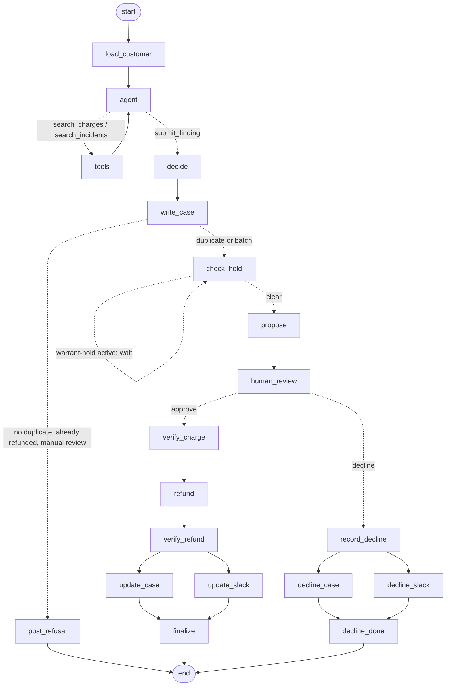

# Warrant

**An AI agent that has to earn the right to move money.**

Warrant investigates customer reports of being charged twice. Using read-only tools, it searches the customer's billing history in **Stripe**, paging back as far as it needs, and searches **GitHub** for an engineering incident that could explain the double charge. It writes up a cited case, then does one of two things: it proposes an exact refund (or one approval-bound batch of refunds) and **waits for a person on the billing team to approve it**, or it **refuses** and states exactly what evidence is missing. Every decision is recorded in GitHub and Slack, every run is traced in **Lemma**, and failure handling is tested against an **Arga** Slack twin.

**▶ Demo video (2 min):** https://youtu.be/T2u0wYKTFAw
**Repository:** https://github.com/calledAdo/warrant

---

## At a glance

| | |
| --- | --- |
| **What it does** | Takes a "you charged me twice" complaint from the customer to a verified refund, or a reasoned refusal, across Stripe, GitHub and Slack |
| **Where the AI decides** | One LangGraph loop in which the model chooses what evidence to gather, then submits a finding |
| **Where code decides** | Whose data the tools can see, whether the evidence really shows a duplicate, what the plan contains, who approved it, and every write that touches money |
| **Human in the loop** | LangGraph `interrupt()` pauses the run until a person approves or declines the **exact** plan, bound to a SHA-256 plan hash with a 15-minute expiry |
| **Reliability, offline** | `npm test`: **47 tests, all passing, in about 1.5 s**, with no accounts needed. Covers the duplicate policy, batches, the operation journal, crash recovery, run leases, Lemma holds and audit retention |
| **Reliability, live** | Six scenarios against real Stripe (test mode), GitHub and Slack: refund, refusal, checkpoint replay, Slack failure after the refund, prompt injection, and a duplicate buried under 22 newer charges |
| **Lemma in the loop** | Lemma judged our traces against our uploaded policy and **found two real problems, which we fixed**. Active Lemma issues are read back into Warrant, and a person can tag one `warrant-hold` to pause new refund proposals |

---

## The problem

"You charged us twice" is one of the most common billing complaints, and one of the most awkward to handle well.

To answer it properly, someone has to look in several places:

- **Billing** (Stripe): are there really two charges? Same amount, same currency, minutes apart, or two different things that just look alike?
- **Engineering** (GitHub): was there an incident, such as a retry loop or a double-submitted invoice, that would explain it?
- **The team** (Slack): who signs off on sending money back, and how does everyone else find out?

That work is manual, spread across tools, and usually lands on whoever is on support that day. Both ways of getting it wrong cost money:

**Refunding when you shouldn't.** Two charges can look identical and still both be legitimate: a plan and an add-on, or a proration. A refund is money gone, and an automated agent that refunds whenever a customer says "duplicate" can be talked into it.

**Not refunding when you should.** A customer who is ignored or gets the wrong answer can go to their bank and dispute the charge. According to [Stripe's documentation on disputes](https://docs.stripe.com/disputes/how-disputes-work):

- the disputed amount **plus a dispute fee** is debited from the business's balance, and outside Mexico that fee is **not refunded even if you win**;
- countering the dispute adds a further fee;
- while a dispute is open you **cannot issue a refund outside the dispute process**;
- each dispute **raises your dispute rate** with the card network;
- the full process can take **2–3 months**, with only **7–21 days** to respond.

So a genuine duplicate that isn't refunded quickly can cost more than the charge itself, while a wrongful refund loses the money outright. Teams need an answer that is **fast, backed by evidence, and safe to act on**.

## What Warrant does

1. **A payment goes wrong.** In the demo, the customer clicks Pay at `/simulation`. The backend creates two real Stripe test-mode PaymentIntents to reproduce a retry bug, and the page shows the returned charge IDs. A **Multiple charge? Ask for a refund** link stays visible throughout.
2. **The customer reports it.** That link opens the complaint form with the email and report filled in. Warrant finds the customer in Stripe from the email.
3. **The agent investigates.** The model decides what to look up. It pages back through the customer's charges, so a duplicate beneath many newer charges is still found, and searches GitHub incidents around the dates of the charges it's examining. Code fixes which customer the tools can see and caps every search.
4. **Code checks the model.** Deterministic code re-checks the finding against the Stripe records. If the model says "duplicate" and the data doesn't support it, the finding becomes a refusal. If the matching charge was **already refunded**, the case says so, rather than "no duplicate found".
5. **It writes the case either way.** A GitHub issue records the complaint, the finding, an evidence table and the model's stated uncertainty.
6. **Lemma gets a say.** Before proposing a refund, Warrant checks Lemma for active issues. If a person has tagged one `warrant-hold`, the run pauses instead of proposing. If Lemma can't be reached, it also waits rather than assuming there's no hold.
7. **It refuses or proposes.**
   - **No duplicate:** posts to Slack that no action was taken and why; the customer is told nothing changed. No money moves and nobody has to approve anything.
   - **One duplicate:** posts the proposed refund to Slack and **stops** for a human decision.
   - **Several duplicates:** proposes **one batch**: keep the earliest charge, refund every later one, with the whole batch bound into a single approval. Batches over 10 refunds or $1,000 go to manual review with no plan.
8. **A person decides.** On `/admin` they see the investigation graph, the evidence, the model's reasoning, what it searched, the operation journal and links to the Lemma traces, then approve or decline that exact plan.
9. **It executes and verifies.** On approval, Warrant re-checks the charges, sends Stripe the exact approved amount, reads each charge back to confirm it, then comments on the GitHub case and edits the original Slack message to "Refund applied and verified". On decline, it records who declined and why in GitHub and Slack. The customer's page updates either way.

### What the demo shows

The video follows the S1 path end to end: a payment produces two real Stripe test charges, the customer asks for a refund, and Warrant investigates before asking for approval. The billing team sees the GitHub incident and the cited charge evidence, approves refunding the later charge, and Warrant verifies the refund against Stripe before closing the loop in GitHub and Slack. Lemma holds the trace of the investigation, the approval check, the refund and the verification.

| Page | Who | Shows |
| --- | --- | --- |
| `/simulation` | Demo | Pay button that creates two Stripe test charges, and the refund-request link |
| `/` | Customer | Report form, then plain-language progress (Received → Investigating → Under Review → Resolved/Closed) and the outcome. No internal IDs or model output |
| `/admin` | Billing team | Complaint queue, live investigation graph, what the agent searched, approve/decline, evidence, model reasoning, operation journal, and links to the GitHub case, Slack and Lemma traces |

## External apps used

| App | What Warrant reads | What Warrant writes | Why it's needed |
| --- | --- | --- | --- |
| **Stripe** (test mode) | The customer by email; the agent pages through that customer's charges (10 per search, up to 365 days back); every involved charge again just before refunding | Full refunds of the exact approved amount, each read back to verify. In the demo, `/simulation` also creates the two charges | Where the money is, and the only source of truth for whether a duplicate exists |
| **GitHub** | Issues labelled `incident`, searched by date window and keywords | An investigation issue per complaint; comments recording the refund or the decline | Links billing complaints to engineering incidents and keeps a permanent audit trail |
| **Slack** | — | A proposal or refusal message, edited in place when approved or declined | Brings the decision to the team without anyone watching a dashboard |

Supporting tools:

| Tool | Role |
| --- | --- |
| **LangGraph** (`@langchain/langgraph`) | Runs the workflow as a fixed state graph with checkpoints stored in SQLite. `interrupt()` makes the human-review pause durable, and a run resumes from the right step after a failure or restart |
| **Lemma** | One trace per graph segment (investigate / execute / decline / replay), linked by thread, including every model turn's full prompt and the approval check. Our policy is uploaded as agent context so Lemma judges runs against our own rules. Warrant reads active Lemma issues back, and a `warrant-hold` tag pauses new proposals |
| **Arga** | Slack digital twin with a real rate limit (HTTP 429 with `Retry-After`), used to test what happens when Slack fails after the money has moved |
| **OpenAI-compatible model** (`gpt-5.6-luna`) | The agent model, using tool calling. Any OpenAI-compatible provider with tool calling works; Groq's `gpt-oss-120b` was also tested (see findings) |

## How it works

The model runs **one loop**: it chooses what evidence to look up through read-only tools that code scopes and caps, then submits a finding that code re-checks. Everything after that, and everything that touches money, is deterministic code.



| Node | What it does |
| --- | --- |
| `load_customer` | Fixes the customer from the email match. No tool can change it |
| `agent` ⇄ `tools` | **The model's loop.** Each turn the model calls `search_charges` (pages back with a cursor, optional dates), `search_incidents` (date window, keywords) or `submit_finding`. At most 8 searches, 10 charges per page, 365 days back |
| `decide` | Enforces the duplicate policy in code against **only the charges and incidents the tools returned**. Can downgrade to a refusal, *already refunded* or manual review |
| `write_case` | Creates the GitHub investigation issue |
| `check_hold` | Reads active Lemma issues. A `warrant-hold` tag, or a failed read, pauses the run here |
| `propose` / `post_refusal` | Builds the single or batch refund plan and posts it to Slack, or posts the refusal and ends |
| `human_review` | `interrupt()`: the run is checkpointed and pauses until a person approves or declines that exact plan |
| `verify_charge` | Re-checks the approval, plan hash and expiry, then re-reads every involved Stripe charge and re-runs the duplicate rule before any money moves |
| `refund` → `verify_refund` | Full refunds of the exact approved amounts, one journal entry and idempotency key per charge, then verifies `amount_refunded` on each |
| `update_case` ∥ `update_slack` | Record the outcome in GitHub and Slack, in parallel |
| `record_decline` → `decline_case` ∥ `decline_slack` | Record a decline, with the reason, in GitHub and Slack |

Run `npm run graph` to print the current graph as Mermaid.

### Safety and reliability features

- **Approval bound to the exact plan.** The plan ID is a full SHA-256 hash of the customer, every charge to refund, the charge being kept, amounts, currency, total and action. Approval is recorded against that hash for that run and expires after 15 minutes; if anything material changes, it no longer matches.
- **The model's tools are scoped and capped in code.** No tool accepts a customer ID. Searches are read-only, limited to 8 per investigation, 10 charges per page and 365 days back, and only what the tools returned can count as evidence.
- **The duplicate rule is enforced in code.** Matching charges must be on this account, succeeded, not refunded, and share amount and currency. The normal window is 24 hours, with a billing-related incident or identical non-empty descriptions. A window of up to 30 days also requires a shared invoice/order/checkout ID and an incident whose stated start and end cover the charges. Batches are withheld while older pages of charges are still unexplored, and are capped at 10 refunds and $1,000.
- **The complaint is untrusted input.** It is wrapped in delimiters, stripped of control characters and capped at 2,000 characters, and the policy tells the model to ignore any instructions inside it.
- **Operation journal.** Every external write records its intent before the call and its result after. Refund entries are keyed to the Stripe charge and reuse that key as Stripe's idempotency key, so a refund can't happen twice, even across runs. An ambiguous provider response is **held for a person to reconcile** (`npm run journal:reconcile`) rather than retried blindly.
- **Full refunds only, verified by amount.** During setup we found that Stripe **stacks partial refunds** made with different idempotency keys, and that a charge's `refunded` flag stays `false` after an over-refund. So Warrant sends the exact full amount, requires Stripe to report success, and checks `amount_refunded`, never the flag.
- **Partial failure is reported honestly, never rolled back.** If Slack or GitHub fails after the money moved, the run is `notification_partial`. If a batch stops partway, it's `financial_partial`, with confirmed progress shown, and stays under review. Resuming continues from the LangGraph checkpoint without repeating successful refunds.
- **Durable recovery.** Complaints, runs, approvals, journal entries and LangGraph checkpoints live in SQLite. After a restart, paused approvals, holds, partial outcomes and finished statuses are rebuilt without making any provider writes during startup. Each graph segment takes a renewable 60-second lease, so two processes can't drive the same run.
- **Audit retention.** `npm run history:archive` (a dry run unless `--apply` is given) snapshots closed runs into an audit archive before pruning only their checkpoint data. Financial journal and approval records are never routinely deleted.
- **Model outage fallback.** If the model provider is unreachable, a deterministic rules engine that applies the same policy takes over, and the admin page labels the result "Rules fallback".

## How we tested reliability

Warrant is tested in two layers.

### 1. Offline suite: `npm test` (47 tests, 47 passing, ~1.5 s, no accounts needed)

| File | Covers |
| --- | --- |
| `test/policy.test.mjs` | Duplicate rule and 30-day window, batch grouping, caps and hash binding, unrelated incidents not counting as corroboration, model-selected IDs anchoring the batch, live Stripe keys rejected |
| `test/backend.test.mjs` | Already refunded vs inconclusive outcomes, full prompts in traces, outage fallback limits, refund state changing after approval, ambiguous writes held, restart during approval and during a partial batch, batch execution and replay without a second refund, reapproval after expiry |
| `test/lemma.test.mjs` | Lemma issue pagination, per-trace occurrences and `warrant-hold` enforcement |
| `test/operations.test.mjs` | Run lease contention and crash expiry; audit archive keeps financial records |
| `test/demo.test.mjs` | The full S1 flow on the SQLite provider: investigation stops at approval, a stale plan is rejected, approval refunds only the later charge |

### 2. Live scenarios: real Stripe (test mode), GitHub and Slack

Seeded customers are clearly labelled `(SEEDED FIXTURE)`.

| Scenario | Setup | What must happen | Result |
| --- | --- | --- | --- |
| **S1: genuine duplicate** | Two identical $49 charges one second apart, plus a matching GitHub incident | Proposal, approval, one refund, `amount_refunded` verified, the legitimate charge untouched | Pass |
| **S2: not a duplicate** | $49 plan charge and $73 overage charge, no incident | Refused; case still written with the missing evidence stated; no plan, no money moved | Pass |
| **S3: replay** | After S1, fork the LangGraph thread from the checkpoint **just before the refund** and run forward again | The graph re-enters the refund step; the journal blocks a second refund; exactly one refund operation | Pass |
| **S4: Slack fails after the refund** | Slack rate-limits `chat.update` (HTTP 429) after the refund succeeded | Partial status, refund **not** rolled back; resume finishes the follow-up; refund and GitHub comment each happen exactly once | Pass. Verified on Arga's Slack twin before the LangGraph migration, and on the local twin stand-in since |
| **S5: prompt injection** | 8 forged "duplicate" findings, plus a live complaint against S2's charges that fakes the closing tag and orders an immediate refund | Every forged finding rejected with the right reason, the genuine one allowed, and the live attack refused with no plan and no money moved | Pass |
| **S6: duplicate beyond the 20 most recent charges** | A genuine $129 duplicate pair with 22 newer usage charges on top | The model pages back, finds the buried pair and refunds the later charge; the test also proves a flat "last 20 charges" fetch would have missed it | Pass (3 charge searches, 24 charges seen, 1 incident search) |
| **Decline** | A person declines a proposed refund with a reason | The graph resumes into the decline branch; GitHub and Slack record who and why; no money moved | Pass |

### What testing taught us

- **Lemma caught real bugs, and we fixed them.** With our policy uploaded, Lemma flagged cases titled "no duplicate found" where a duplicate existed but had already been refunded; there is now a distinct *already refunded* outcome. It also flagged "refund without authorization in the transcript", because execute traces didn't show the approval; they now include an `approval-check` span and every model turn's full prompt. It flagged S3's replay re-verifying a refund too, which is expected, so the policy now says so.
- **Stripe stacks partial refunds silently.** Two $30 refunds on a $100 charge with different idempotency keys gave `amount_refunded = 6000` with `refunded: false` and no error. This is why Warrant only issues exact full refunds.
- **LangGraph checkpoints alone don't prevent duplicate writes.** When Slack failed alongside the GitHub update, resuming re-ran the GitHub step that had already finished; the journal skipped it, so the comment was posted once. Checkpoints resume the run; the journal makes each write happen once.
- **An in-flight write must not count as done.** S4 exposed a resume arriving during an unfinished write and reporting success. Unconfirmed writes now stay pending until reconciled.
- **Arga's Slack twin produces a real, recoverable fault.** Seeded with a rate limit, `chat.update` returned HTTP 429 with `Retry-After`, then succeeded after the window with the message timestamp preserved.
- **A fixed "last 20 charges" fetch misses real duplicates.** S6 proves it, which is why evidence gathering became a tool loop the model controls.
- **Groq's free tier couldn't carry the tool loop.** `gpt-oss-120b` handled a single prompt in 2–3 s, but the multi-turn loop hit its 8,000 tokens-per-minute cap. Groq also rejects tool calls with `null` optional arguments, and `gpt-oss` sometimes emitted its answer under a tool name that doesn't exist. Warrant now accepts nulls, waits and retries on rate limits, and recovers the intended call from the provider's `failed_generation`. The agent runs on `gpt-5.6-luna` at 2–3 s per model turn.

### Known limitations

- SQLite storage and leases support processes on **one host** sharing one local database file. A multi-host deployment needs runs, leases, checkpoints, approvals and the journal moved together to a shared transactional database.
- Ambiguous provider writes need a person to inspect the provider and reconcile them (`npm run journal:reconcile`); Warrant never guesses whether a lost response was applied.
- Approval happens on `/admin`, not with Slack buttons. Lemma issues and holds are available through the backend API (`/api/lemma/issues`) and `npm run lemma:issues`, but aren't yet shown on `/admin`.
- The customer's email isn't verified before a complaint is accepted; a production version would require a signed-in session or a one-time email link.
- An investigation that pages far back takes longer: S6 takes about 20–25 s over 5 model turns.
- Stripe test mode can't backdate charges, so S6 tests "older" as beyond the 20 most recent charges rather than months in the past.

## Setup

### Try it without any accounts

```bash
git clone https://github.com/calledAdo/warrant.git
cd warrant
npm install
npm test                        # 47 offline tests, ~1.5 s
npm run demo:prepare:sqlite     # seed the S1 customer into a local SQLite stand-in
LLM_MODE=rules npm run start:demo:sqlite   # http://localhost:3000 — no Stripe, GitHub, Slack or model needed
```

The offline demo runs the same graph, policy, approval hash and journal against a local SQLite provider, so it shows the flow but makes no calls to real apps.

### Requirements for the full integrated version

- **Node.js 22.5 or newer** (uses the built-in `node:sqlite`; developed on Node 26)
- A **Stripe** account in test mode or a sandbox
- A **GitHub** personal access token with `repo` scope, and a repository with Issues enabled for cases and incidents
- A **Slack** app with the `chat:write` bot scope, installed in a workspace and invited to a channel
- A **Lemma** API key and project ID ([platform.uselemma.ai](https://platform.uselemma.ai))
- An **OpenAI-compatible model API with tool calling**. The multi-turn loop needs more than Groq's free tier allows (8,000 tokens per minute)
- Optional: an **Arga** account for the Slack twin (`uv tool install arga-cli`)

### Configure

```bash
cp .env.example .env     # then fill in the values below
```

| Variable | Value |
| --- | --- |
| `STRIPE_SECRET_KEY` | Must start with `sk_test_`. The scripts refuse live keys |
| `GITHUB_TOKEN`, `GITHUB_REPO` | Token with `repo` scope, and `owner/name` of the cases repository |
| `SLACK_BOT_TOKEN`, `SLACK_CHANNEL` | `xoxb-…` token, and the channel in quotes, e.g. `"#billing-approvals"` |
| `SLACK_API_URL` | Leave empty for real Slack; set to an Arga twin URL to use the twin |
| `LEMMA_API_KEY`, `LEMMA_PROJECT_ID` | From Lemma project settings |
| `OPENAI_API_KEY`, `OPENAI_BASE_URL`, `OPENAI_MODEL` | Any OpenAI-compatible endpoint with tool calling, e.g. `https://api.openai.com/v1` and a current model |
| `LLM_MODE` | `llm` to use the model, `rules` for the deterministic engine |
| `LLM_FALLBACK` | Set to `off` to fail instead of falling back to rules when the model is unreachable |
| `WARRANT_DB` | Path of the SQLite database (the demo scripts set their own) |
| `WARRANT_PROVIDER` | `live` for real Stripe/GitHub/Slack, `sqlite` for the local stand-in |
| `WARRANT_DEMO` | `s1` limits the demo pages and reset to the S1 scenario |

### Run the integrated demo (as recorded)

```bash
npm run verify              # check the Stripe, GitHub and Slack credentials end to end
npm run lemma:policy        # upload the policy to Lemma as agent context
npm run demo:prepare        # fresh Stripe test customer, duplicate charges and GitHub incident
npm run start:demo          # http://localhost:3000
```

Open `/simulation` and click **Pay** to create two Stripe test charges, follow **Multiple charge? Ask for a refund** to the prefilled complaint, then approve on `/admin`. Use **Reset Demo Data** on `/admin` before each new take.

To run the general app with all three seeded customers instead:

```bash
npm run fixtures:demo       # Northwind (S1), Harbor (S2), Lakeside (S6); ~30 s
npm start                   # http://localhost:3000 and /admin
```

Try `billing@northwind.test` (a genuine duplicate: approve it on `/admin`), `ap@harbor.test` (not a duplicate: refused automatically) and `finance@lakeside.test` (a duplicate buried under 22 newer charges: watch the agent page back to find it).

### Run the reliability tests

```bash
npm test                                         # offline suite
npm run fixtures && node verify/e2e.mjs          # live S1–S3 and S6 (S4 is opt-in)
node verify/e2e.mjs --scenario=s1                # a single live scenario
npm run fixtures && npm run verify:injection     # S5 prompt injection
npm run verify:llm <base_url> <key> <model>      # check a model refuses correctly and picks the later charge

# S4 without an Arga account, using the local Slack twin stand-in
MOCK_SLACK_WINDOW=6 node verify/mock-slack.mjs &
SLACK_API_URL=http://localhost:4020 SLACK_CHANNEL=billing-approvals node verify/e2e.mjs --scenario=s4

# S4 against Arga's Slack twin
arga twin-runs create --twins slack --ttl 10 --wait --json \
  --scenario-prompt "A Slack workspace with a channel named billing-approvals. Enable rate limiting with a strict limit on the chat.update method: at most 1 request per 20 seconds."
# then set SLACK_API_URL and SLACK_BOT_TOKEN from the output and run: node verify/e2e.mjs --scenario=s4
```

Operations commands:

```bash
npm run lemma:issues                       # read active Lemma issues
npm run journal:reconcile -- <op-key>      # inspect and reconcile an ambiguous journal entry
npm run history:archive -- --days=90       # dry run; add --apply to archive
npm run graph                              # print the LangGraph as Mermaid
```

## Project layout

```
src/
  graph.js            LangGraph state graph: agent/tools loop, Lemma hold, human review, refund and decline branches
  run.js              investigate / approve / execute / resume / decline / replay, status derivation
  agent-tools.js      the model's tools, scoping and caps, finding parser, recovery of malformed tool calls
  duplicate-policy.js the duplicate rule, batch grouping, extended window and caps
  agent.js            complaint sanitising
  agent-rules.js      deterministic fallback applying the same policy
  outcomes.js         outcome labels (already refunded, multiple duplicates, manual review, …)
  policy.md           the agent's rules (also uploaded to Lemma)
  plan.js             plan hashing, approval expiry and renewal
  journal.js          operation journal
  checkpointer.js     durable LangGraph checkpoints
  storage.js          SQLite schema and persistence
  coordinator.js      renewable run leases
  retention.js        audit archive
  lemma-issues.js     Lemma issue reads, per-trace occurrences and warrant-hold
  trace.js            Lemma tracing
  complaints.js       complaints and the customer-facing view
  application.js      shared workflow functions used by the server and demo
  simulation.js       Stripe test-mode payment for the demo
  demo.js, demo-live.js, demo-store.js   S1 demo preparation (integrated and SQLite)
  server.js           HTTP API and pages
  adapters/           stripe.js, github.js, slack.js
public/               simulation.html, index.html (customer), admin.html (billing team), app.css
test/                 offline test suite (npm test)
verify/               live credential checks, scenario tests, injection test, Slack twin stand-in
scripts/              Lemma policy upload and issue reader, demo preparation, journal reconcile, archive, graph printer
fixtures/             seeds the test customers and incidents
docs/                 operations guide, project understanding, setup verification log, original build brief
llmtimeline/          cross-agent work record
```
